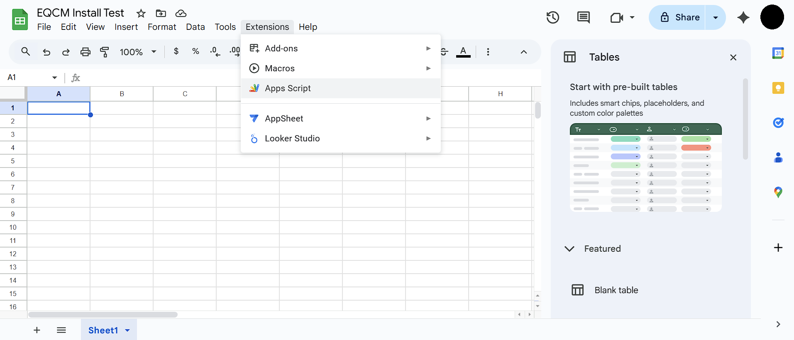

# EQ Character Manager

Electron tray companion for EverQuest that watches your logs, keeps raid utilities up to date, and mirrors the data you need into CSVs or Google Sheets.

## Highlights
- Track the latest zone per **log file** (character + server) with automatic backscan and manual rescan controls.
- Infer **Claws of Veeshan faction** standings from `/con` lines, applying invisibility and combat bias heuristics so standings remain stable.
- Parse `*-Inventory.txt` exports, build a rich **Raid Kit** summary (fixed + custom items), and push a character’s inventory into its own Google Sheet tab.
- Manage a favorite roster: filter CSV output and Sheet upserts to only the characters you care about, or merge/replace the list from your Sheet.
- Tray actions: copy the latest Log files “Players on EverQuest” block to the clipboard, push inventory for any character, open data folders, trigger update checks, or jump straight to the bundled docs.
- Google Apps Script integration performs change-detected upserts for Zone Tracker, CoV Faction, Inventory Summary, and per-character Inventory Items tabs.



> Additional step-by-step screenshots (`assets/apps_script_screenshot2.png` – `assets/apps_script_screenshot14.png`) illustrate the full Apps Script setup flow referenced below.

## Requirements
- Node.js 18+ (Electron 30 is bundled through `npm install`).
- Windows 10/11 for the packaged installer (development works anywhere Node + Electron runs).

## Quick Start
```bash
npm install
npm run start   # launches the Electron tray app
```

- `npm test` runs the raid kit core unit test.
- `npm run dist` creates the Windows installer (generates `build/icon.ico` before running `electron-builder`).

## Configure the App
1. From the tray icon, open **Settings…** and point the app at your EverQuest `logs` folder and the directory containing your `*-Inventory.txt` files.
2. (Optional) Provide your Google Sheet URL so tray shortcuts open the right spreadsheet.
3. Pick a scan cadence from the **Scan interval** submenu (30–300 seconds) or use **Rescan now** for an immediate pass.
4. Fine-tune advanced behavior:
   - **Favorites…** lets you select characters, toggle Favorites-only filtering, merge the roster with the Sheet, or replace it entirely.
   - **Raid Kit…** manages fixed and custom items so CSV/Sheet summaries stay aligned.
   - **CoV Mob List…** adds/removes mobs or resets to bundled defaults for `/con` parsing.
   - **Advanced…** exposes debug logging plus Replace All / Force Replace All actions for Google Sheets.

## Tray Actions at a Glance
- **Copy Last Log** copies the newest “Players on EverQuest” roster to the clipboard and shows a desktop notification.
- **Push inventory to sheet → &lt;Character&gt;** creates or refreshes a dedicated tab (`Location`, `Name`, `ID`, `Count`, `Slots`) for that character.
- Quick links open the configured Google Sheet, the app data directory, or the local CSV folder.
- Start, pause, or rescan the watcher without opening windows; the tooltip shows version, scan status, time zone, and folders.

## Local Data & CSV Output
Runtime files live under `%APPDATA%\EQ Character Manager\data` (fallback `~/.eq-character-manager/data`). The app writes:
- `settings.json`, `state.json`, and `eqwatcher.log` for configuration/state and diagnostics.
- `Zone Tracker.csv`
- `CoV Faction.csv`
- `Raid Kit.csv`
- `Inventory Items - <Character>.csv`

You can override the CSV directory from **Settings → Local CSV output**; the tray menu offers a shortcut to open it.

## Google Sheets Integration (Optional)
1. Open the bundled guide at `docs/deploy-sheets.html` (tray → **Getting Started**).
2. Create or reuse a Google Apps Script project, then paste in `docs/Code.gs`.
3. Deploy the script as a web app, copy the `/exec` URL and secret, and enter them in **Settings**.
4. Use **Advanced… → Replace All** for the first sync; subsequent scans perform change-detected upserts automatically.

Refer to the Apps Script screenshots in `assets/` if you need visual cues for each deployment step.

## Troubleshooting
- **Logs:** check `eqwatcher.log` in the data directory for scan, webhook, or Google Sheet errors.
- **Verbose output:** enable debug logs from **Advanced…** to capture detailed `/con` bias decisions.
- **Updates:** the tray offers **Check for updates…** and a link to the GitHub Releases page.

## Development Notes
- Main process entry: `main.js`; preload bridge: `renderer.js`; raid kit utilities: `src/raidkit-core.js`.
- Asset icons live in `assets/`; multi-size icon bundling runs automatically via `npm run dist`.
- Tests reside in `tests/`.
